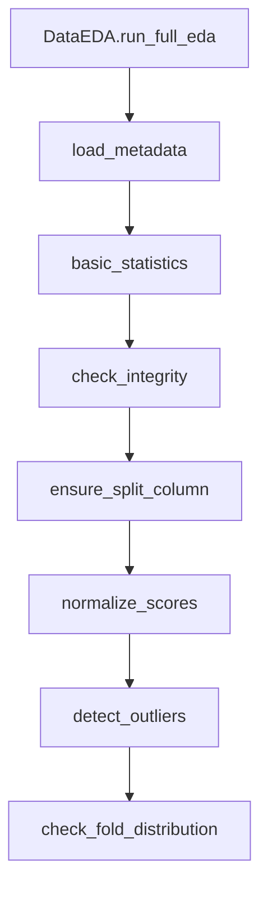

# `src/data/eda/` — 数据探索与分析模块

该模块是整个数据流水线的**第一道质量关卡**，负责数据集加载前的**完整性检查、统计分析、划分策略和可视化**。

---

## 📋 模块职责

| 文件                    | 核心职责                              |
| ------------------------- |--------------------------------------- |
| `integrity.py`          | 媒体文件完整性校验（损坏、黑帧、白帧、跳帧等） |
| `statistics.py`         | 数据集统计分析（分辨率、帧率、MOS分布等） |
| `split.py`              | 分层数据集划分（Train/Val/Test + K-Fold） |
| `metrics_plotter.py`    | 训练曲线、残差分析、模型对比可视化     |

---

## 📂 文件详解

### 1. `integrity.py` — 媒体完整性检查

**功能**：检测图片/视频是否损坏或存在严重质量问题。

#### 核心函数

| 函数 | 参数 | 返回值 | 说明 |
| ------ | ------ | -------- | ------ |
| `check_media_integrity` | `path`, `media_type`, `sample_interval=30` | `(bool, str|None, dict)` | 统一入口 |
| `check_image_integrity` | `path` | `(bool, str|None, dict)` | 图片专用 |
| `check_video_integrity` | `path`, `sample_interval` | `(bool, str|None, dict)` | 视频专用（优先 Decord） |

**检查项**：

- **图片**：可解码、分辨率有效（width > 0 且 height > 0）、非全黑/全白、颜色种类 ≥ 2
- **视频**：可解码、实际解码帧数与视频文件声称的帧数偏差不超过 10%、黑帧/白帧比例、坏帧比例、跳帧检测（基于时间戳间隔统计：帧间隔 > 平均间隔 × 1.5 判定为跳帧）

**诊断信息示例**：
```python
{
    "frame_count": 240,                # 文件声称的帧数
    "actual_frames": 240,              # 实际成功解码的帧数
    "black_frames": 0,                 # 黑帧数量
    "white_frames": 0,                 # 白帧数量
    "bad_frames": 2,                   # 坏帧数量（帧间差异 < 0.5）
    "frame_drops": False,              # 是否检测到跳帧
    "irregular_interval_ratio": 0.08,  # 帧间隔异常比例（> 0.2 表示明显跳帧）
    "fps": 30.0,
    "resolution": (1920, 1080)
}
```

---

### 2. `statistics.py` — 数据集统计分析

**功能**：生成数据集的全面统计报告。

#### 核心函数

| 函数 | 主要功能 |
| ------ | ---------- |
| `analyze_image_properties` | 图像分辨率、宽高比、文件大小、颜色空间 |
| `analyze_video_properties` | 视频帧率、时长、分辨率、编码格式 |
| `compute_mos_statistics` | MOS/DMOS 分布（均值、标准差、偏度、峰度、离群值） |
| `generate_full_statistics_report` | 整合图像+视频+评分完整报告 |
| `print_statistics_report` | 美观打印报告 |

---

### 3. `split.py` — 数据集划分

**功能**：确保分数分布均衡的分层划分。

#### 核心函数

| 函数 | 功能 |
| ------ | ------ |
| `split_train_val_test` | 按比例分层切分 Train/Val/Test |
| `split_from_config` | 从 `dataset_config.yaml` 里的 `split` 字段读取比例 |
| `add_split_column` | 给原 DataFrame 添加 `split` 列 |
| `check_fold_distribution` | 检查 K-Fold 交叉验证分数分布一致性 |

**特点**：
- 使用 `pd.qcut` 进行分层（优先分位数，失败回退均匀分箱）
- 保证各集 MOS 分布一致
- 支持从配置文件读取划分比例

---

### 4. `metrics_plotter.py` — 可视化工具

**功能**：生成高质量的训练与评估可视化图表。

#### 主要方法

| 方法 | 输出内容 | 保存路径命名规则 |
| ------ | ---------- | ------------------ |
| `plot_training_history` | Loss、PLCC、SROCC、RMSE、R²、KROCC 曲线 | `{date}_{task}_{model}_training_history.png` |
| `plot_residuals` | 残差散点、预测vs真实、残差分布 | `{date}_{task}_{model}_residuals.png` |
| `plot_traditional_metrics_distribution` | SSIM/VIF/DLM/VMAF/NIQE vs MOS 回归图 | `{date}_{dataset}_traditional_benchmarks.png` |
| `plot_comparison` | 多模型 PLCC/SROCC/RMSE 对比柱状图 | `comparison_arena_{dataset}_{date}.png` |

---

## 🔄 数据流（推荐使用流程）



---

## ⚙️ 重要设计要点

- **性能**：视频完整性检查优先使用 **Decord**（Decord 在随机帧访问场景下性能显著优于 OpenCV）
- **可配置**：支持 `skip_integrity=True` 加速 EDA 流程
- **可复现**：随机种子固定 + 分层采样
- **标准化**：MOS 归一化到 [0, 1]，保存 `mos_min`/`mos_max` 用于反归一化
- **输出规范**：所有图片统一使用 `{日期}_{任务}_{模型}` 前缀，存于 `results/plots/`

---

## ⚠️ 注意事项

- `skip_integrity=True` 会跳过所有完整性检查，适用于快速测试，生产环境建议关闭
- 视频完整性检查依赖 `decord`，如果未安装会自动回退到 OpenCV
- 分层划分基于 `score_col` 列进行分位数分箱（默认 10 箱），箱数可通过 `bins` 参数调整
- `metrics_plotter` 依赖 `matplotlib` 和 `seaborn`，在无 GUI 环境下会自动使用 `Agg` 后端
- 图片/视频的统计采样默认有数量限制（1000/50），全量分析请手动设置 `sample_limit=-1`
